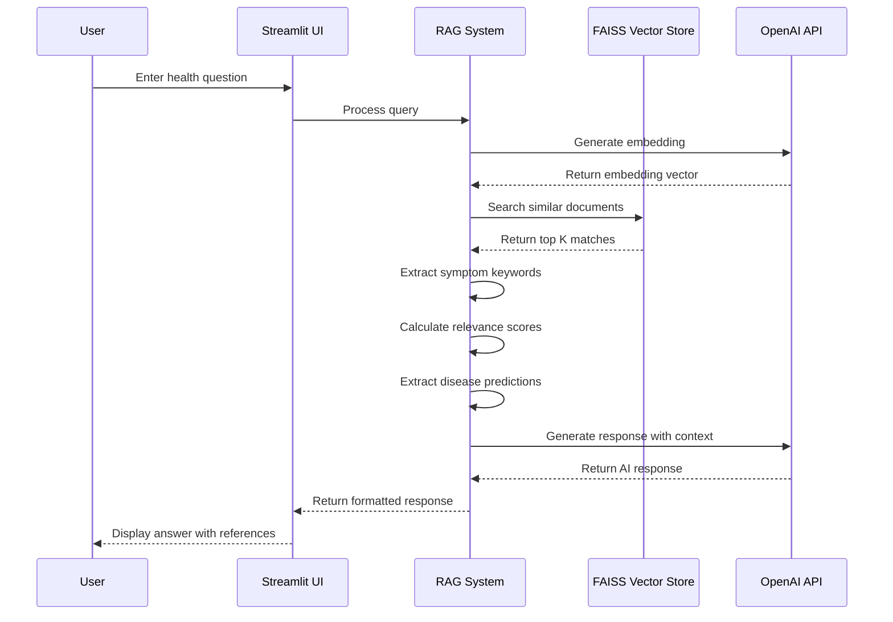
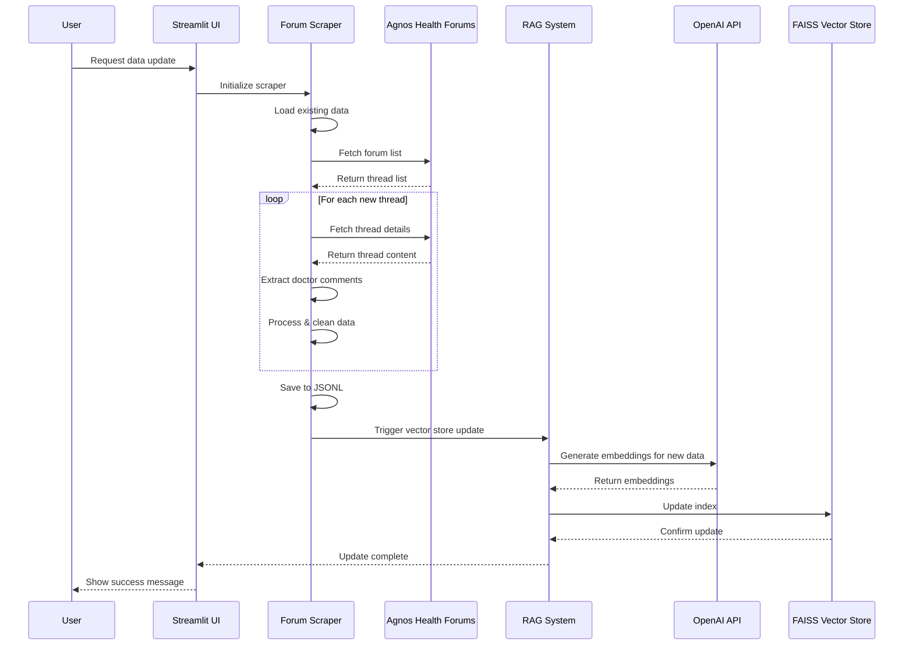
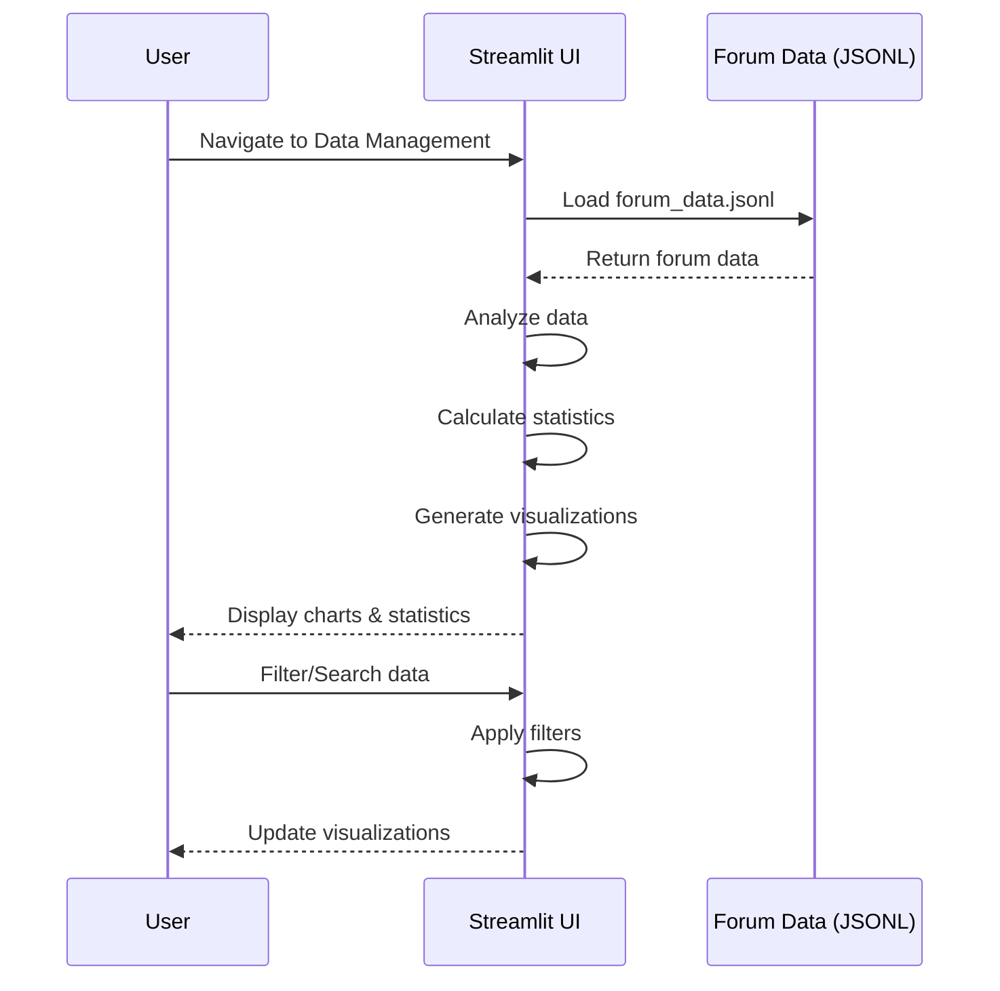

# 🏥 health-assistant-v0.1

An AI-powered health consultation system that combines web scraping, RAG (Retrieval-Augmented Generation), and a user-friendly Streamlit interface to provide intelligent health advice based on real doctor responses from Agnos Health forums.

## 🌟 Features

- **🔍 Intelligent Web Scraping**: Automatically scrapes and processes health forum data with doctor responses
- **🤖 RAG-Powered Chatbot**: Uses GPT-4 Turbo with vector search for accurate, context-aware responses
- **📊 Data Analytics Dashboard**: Visualize health trends, disease distributions, and forum activity
- **🩺 Doctor Insights**: Leverages real medical expert responses from forums
- **🔄 Incremental Updates**: Smart update system that only fetches new content
- **🌐 Bilingual Support**: Full Thai and English language support

## 📦 Key Dependencies

| Package | Version | Purpose |
|---------|---------|---------|
| Python | 3.11.x | Runtime environment |
| Streamlit | 1.39.0 | Web application framework |
| OpenAI | 1.99.4 | GPT-4 API client |
| LangChain | 0.2.12 | RAG orchestration |
| LangChain-OpenAI | 0.3.28 | OpenAI integration |
| FAISS | 1.8.0 | Vector similarity search |
| BeautifulSoup4 | 4.12.3 | Web scraping |
| Pandas | 2.2.2 | Data manipulation |
| **GPT Model** | **GPT-4 Turbo** | **Latest GPT-4 model for enhanced responses** |

## 🏗️ Architecture

```
┌─────────────────────────────────────────────────────────────┐
│                     User Interface Layer                     │
│              (Streamlit Multi-Page Application)              │
│  ┌─────────────────────────┬────────────────────────────┐  │
│  │  Agnos_Health_Chatbot   │     Data_Management        │  │
│  │      (Main Page)        │    (Analytics Page)        │  │
│  └─────────────────────────┴────────────────────────────┘  │
├─────────────────────────────────────────────────────────────┤
│                    Application Core Layer                    │
│  ┌──────────────┐  ┌──────────────┐  ┌──────────────┐     │
│  │AgnosForumScraper│ SimpleAgnosHealthRAG│   Config      │  │
│  │   (scraper.py)  │  (rag_system.py)   │ (config.py)   │  │
│  └──────────────┘  └──────────────┘  └──────────────┘     │
├─────────────────────────────────────────────────────────────┤
│                   LangChain & AI Layer                       │
│  ┌──────────────┐  ┌──────────────┐  ┌──────────────┐     │
│  │  ChatOpenAI  │  │  Embeddings  │  │  FAISS       │     │
│  │  (GPT-4o)    │  │  (text-3)    │  │(Vector Store)│     │
│  └──────────────┘  └──────────────┘  └──────────────┘     │
├─────────────────────────────────────────────────────────────┤
│                      Data Storage Layer                      │
│  ┌──────────────┐  ┌──────────────┐  ┌──────────────┐     │
│  │  Forum Data  │  │Vector Store  │  │   Metadata   │     │
│  │   (JSONL)    │  │ index.faiss  │  │  index.pkl   │     │
│  └──────────────┘  └──────────────┘  └──────────────┘     │
├─────────────────────────────────────────────────────────────┤
│                    External Services                         │
│  ┌──────────────┐  ┌──────────────────────────────────┐   │
│  │  OpenAI API  │  │   Agnos Health Forums             │   │
│  │ (GPT-4o-mini)│  │ (https://www.agnoshealth.com)    │   │
│  └──────────────┘  └──────────────────────────────────┘   │
└─────────────────────────────────────────────────────────────┘
```

## 🔄 System Interaction Flows (Sequence Diagrams)

### 1. User Query Flow


### 2. Data Update Flow


### 3. Analytics View Flow


### Data Flow Pipeline

```
1. Web Scraping Pipeline:
   Agnos Forums → Scraper → Data Processing → JSONL Storage
                              ↓
                     Doctor Comments Extraction
                              ↓
                         Metadata Generation

2. RAG Pipeline:
   User Query → Embedding → Vector Search → Context Retrieval
                                              ↓
                                     GPT-4o Generation
                                              ↓
                                     Enhanced Response
                                              ↓
                                     Forum References

3. Analytics Pipeline:
   Forum Data → Aggregation → Statistical Analysis
                                  ↓
                          Visualization Generation
                                  ↓
                            Interactive Dashboard
```

## 📁 Project Structure

```
agnos-health-assistant-v0.1/
├── streamlit_app/           # Streamlit application
│   ├── Agnos_Health_Chatbot.py  # Main chatbot interface
│   └── pages/              # Multi-page app pages
│       └── Data_Management.py
├── src/                    # Source code modules
│   ├── __init__.py        # Package initialization
│   ├── config.py          # Configuration settings
│   ├── scraper.py         # Web scraping module
│   └── rag_system.py      # RAG implementation
├── data/                   # Data storage
│   ├── forum_data.jsonl   # Scraped forum data
│   ├── vector_store/      # FAISS vector database
│   └── metadata/          # Additional metadata
├── scripts/               # Utility scripts
│   ├── setup.py          # Initial setup script
│   ├── update_data.py    # Data update script
│   └── test_system.py    # System test script
├── requirements.txt      # Python dependencies
├── .env.example         # Environment variables template
├── .env                 # Your configuration (git-ignored)
├── .gitignore          # Git ignore file
├── LICENSE             # MIT License
├── run.sh              # Quick launch script
├── validate.py         # Validation script
└── README.md           # This file
```

## ⚡ Quick Start (2 Minutes)

```bash
# Clone and enter directory
git clone https://github.com/yourusername/health-assistant.git && cd health-assistant-v0.1

# Run automated setup
./setup.sh

# Add your OpenAI API key
nano .env

# Run the application (handles all venv issues automatically)
./start.sh
```

## 🚀 Detailed Setup

### Prerequisites

- **Python 3.11** (Specifically tested with Python 3.11.11)
- OpenAI API key (Get one at https://platform.openai.com/api-keys)
- 2GB free disk space
- Internet connection
- macOS, Linux, or Windows with WSL2

> ⚠️ **Important**: This project requires Python 3.11. Using other versions may cause compatibility issues with LangChain and OpenAI packages.

### Manual Installation (Alternative)

1. **Clone the repository**
```bash
git clone https://github.com/yourusername/health-assistant.git
cd health-assistant-v0.1
```

2. **Run automated setup**
```bash
# This handles everything: Python check, venv creation, dependencies
chmod +x setup.sh
./setup.sh
```

3. **Configure your API key**
```bash
# Edit the .env file created by setup
nano .env

# Add your OpenAI API key:
OPENAI_API_KEY=sk-your-actual-api-key-here
```

4. **Run the application**
```bash
# Use the robust launcher that handles venv conflicts
./start.sh

# Alternative (if you want to use run.sh)
./run.sh
```

The application will open automatically in your browser at `http://localhost:8501`

### Alternative Manual Method

If you prefer to do everything manually:

```bash
# Create virtual environment
python3.11 -m venv venv

# IMPORTANT: Activate virtual environment first
source venv/bin/activate

# Verify you're in the virtual environment (should show venv path)
which python

# Install dependencies
pip install --upgrade pip
pip install -r requirements.txt

# Configure environment
cp .env.example .env
# Edit .env to add your API key: nano .env

# IMPORTANT: Make sure venv is still activated (you should see (venv) in your prompt)
# If not, run: source venv/bin/activate

# Run application
streamlit run streamlit_app/Agnos_Health_Chatbot.py
```

> ⚠️ **Critical**: Always ensure your terminal prompt shows `(venv)` before running any commands. If you don't see it, run `source venv/bin/activate` first.

## 💻 Usage

### Chatbot Interface

1. Navigate to the main page
2. Type your health-related question in Thai or English
3. View AI-generated response with:
   - Medical insights
   - Forum references
   - Doctor recommendations
4. Click suggested questions for quick queries

### Data Management

1. Navigate to the Data Management page
2. **Overview Tab**: View system statistics
3. **Visualizations Tab**: Explore data insights
4. **Dataset Tab**: Browse and search forum data
5. **Update Tab**: Fetch new forum content

### Updating Forum Data

```bash
# Update with new threads only
./venv/bin/python scripts/update_data.py --mode update

# Full refresh
./venv/bin/python scripts/update_data.py --mode full
```

## 🔧 Configuration

### Environment Variables

Create a `.env` file with the following settings:

```env
# Required - Get your API key from https://platform.openai.com/api-keys
OPENAI_API_KEY=sk-your-actual-api-key-here

# Optional Configuration
MAX_THREADS=50                          # Max forum threads to scrape
CHUNK_SIZE=1000                        # Text chunk size for embeddings
CHUNK_OVERLAP=100                      # Overlap between chunks
EMBEDDING_MODEL=text-embedding-3-small # OpenAI embedding model
LLM_MODEL=gpt-4-turbo-preview          # Language model (GPT-4 Turbo for best quality)
```

> 💡 **Tips for API Key**:
> - Never commit your `.env` file to git (it's in .gitignore)
> - Use environment-specific keys for dev/prod
> - Monitor usage at https://platform.openai.com/usage

### Customization

Edit `src/config.py` to modify:
- Scraping parameters
- Model settings
- UI configurations
- Language preferences

## 📊 API Documentation

### Scraper Module

```python
from src.scraper import AgnosForumScraper

# Initialize scraper
scraper = AgnosForumScraper(
    base_url="https://www.agnoshealth.com/forums",
    max_threads=50
)

# Run scraping
scraper.run(mode='update')  # or 'full'
```

### RAG System

```python
from src.rag_system import SimpleRAGSystem

# Initialize RAG
rag = SimpleRAGSystem(
    data_path="data/forum_data.jsonl",
    openai_api_key="your-key"
)

# Query
response = rag.query("อาการปวดหัวบ่อยๆ")
```

## 🧪 Testing

Run tests with:

```bash
# All tests
pytest tests/

# Specific module
pytest tests/test_scraper.py

# With coverage
pytest --cov=src tests/
```

---

Built with ❤️ for better health information access